############################### PATIENT ################################.
Entité Patient dans le package ma.enset.hospital.entities
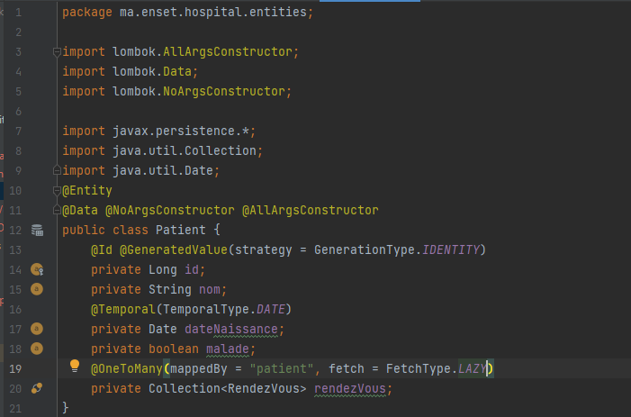

Remplissage de la table patient dans le fichier HospitalApplication
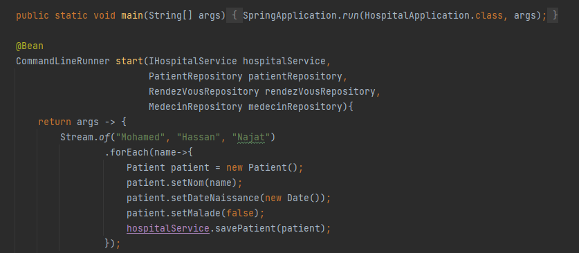

Présentation de la table dans la base de données
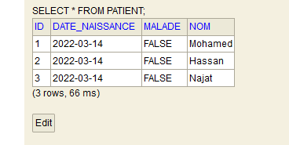

############################### MEDECIN #################################.
Entité Medecin dans le package ma.enset.hospital.entities
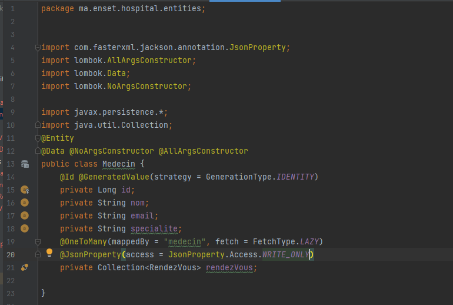

Remplissage de la table dans le fichier HospitalApplication
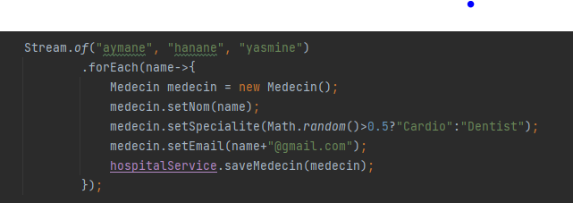

Présentation de la table dans la base de données
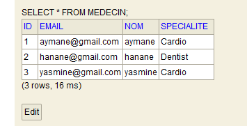

#################################### RENDEZ-VOUS #################################.

Entité RendezVous dans le package ma.enset.hospital.entities
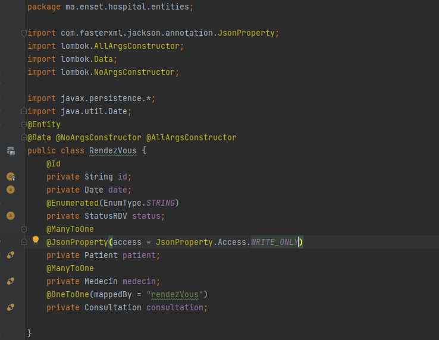

Remplissage de la table dans le fichier HospitalApplication
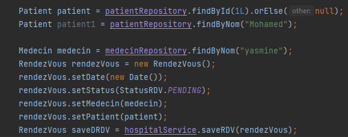

Présentation de la table dans la base de données
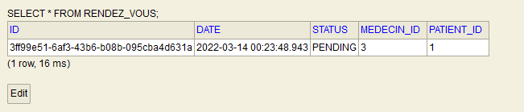

#################################### CONSULTATION #################################.

Entité Consultation dans le package ma.enset.hospital.entities
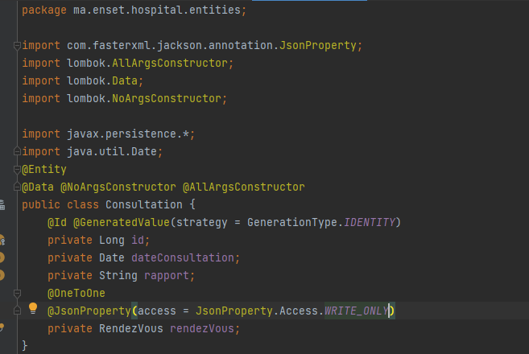

Remplissage de la table dans le fichier HospitalApplication
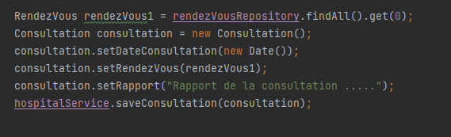

Présentation de la table dans la base de données
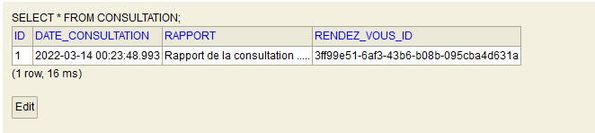

##################################### API REST #####################################.
On va retourner la liste des patients sous format Json à l'adresse http://localhost:8086/patients
Pour cela on crée un controleur dans un package ma.enset.hospial.web
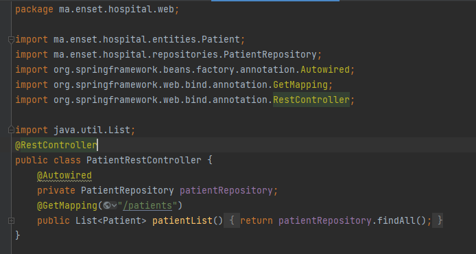

On obtient ainsi:
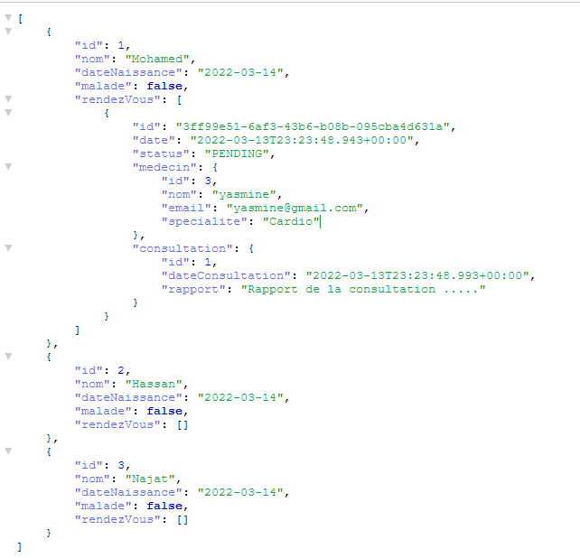

